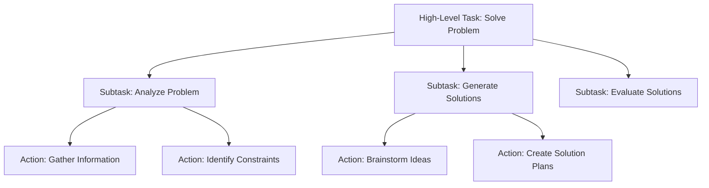

# Planning Methodologies

This section explores planning methodologies in agentic AI systems, including goal decomposition and task scheduling approaches.

## Planning Fundamentals

Planning in agentic AI systems involves the process of determining a sequence of actions to achieve specific goals. Effective planning is crucial for autonomous behavior and goal-directed activity.

### Core Planning Components

#### 1. Goal Representation
Goals in agentic systems must be clearly defined and representable in a computational form:

- **Goal States**: Desired end conditions
- **Goal Hierarchies**: Decomposed goals with sub-goals
- **Temporal Goals**: Time-constrained objectives
- **Resource Goals**: Resource allocation objectives

#### 2. Action Modeling
Actions represent the fundamental operations available to the agent:

- **Primitive Actions**: Basic operations
- **Composite Actions**: Sequences of primitive actions
- **Conditional Actions**: Actions with preconditions and effects
- **Probabilistic Actions**: Actions with uncertain outcomes

#### 3. State Representation
The agent's understanding of the world state:

- **State Variables**: Values describing the current situation
- **State Constraints**: Limitations on possible states
- **State Transitions**: Effects of actions on state variables

## Planning Algorithms

### Classical Planning
Classical planning assumes deterministic, fully observable environments:

```typescript
interface Planner {
  plan(initialState: State, goal: Goal): ActionSequence | null;
}

class STRIPSPlanner implements Planner {
  plan(initialState: State, goal: Goal): ActionSequence | null {
    // Implementation of STRIPS algorithm
    return this.search(initialState, goal);
  }
}
```

### Hierarchical Task Networks (HTN)
HTN planning decomposes high-level tasks into lower-level subtasks:



### Partial Order Planning
Maintains flexibility by ordering actions only when necessary:

- Allows multiple execution orders
- Reduces search space
- Maintains plan robustness

## Goal Decomposition Strategies

### Top-Down Decomposition
Break complex goals into simpler subgoals:

1. **Identify the main goal**
2. **Find operators that achieve the goal**
3. **Determine preconditions as subgoals**
4. **Recursively decompose subgoals**

### Means-Ends Analysis
Compare current state to goal state and select actions that reduce differences:

```typescript
function meansEndsAnalysis(current: State, goal: State): ActionSequence {
  if (current.satisfies(goal)) {
    return [];
  }
  
  const differences = current.compare(goal);
  const relevantOperators = selectOperators(differences);
  
  for (const operator of relevantOperators) {
    const subGoals = operator.preconditions;
    const subPlan = planForSubGoals(current, subGoals);
    
    if (subPlan) {
      return [...subPlan, operator.action];
    }
  }
  
  return null;
}
```

## Multi-Agent Planning

### Coordination Mechanisms
- **Centralized Planning**: Single coordinator assigns tasks
- **Decentralized Planning**: Agents plan independently
- **Hybrid Approaches**: Mix of centralized and decentralized elements

### Communication Protocols
Agents need to coordinate through communication:

- **Contract Net Protocol**: Task assignment through bidding
- **Blackboard Architecture**: Shared workspace for information exchange
- **Market-Based Approaches**: Economic models for resource allocation

## Planning with Uncertainty

### Contingent Planning
Handles situations where the effects of actions are uncertain:

- **Conditional Plans**: Include sensing actions and branches
- **Contingency Handling**: Pre-planned responses to likely contingencies

### Probabilistic Planning
Incorporates probabilities of action success:

```typescript
interface ProbabilisticAction {
  name: string;
  preconditions: Condition[];
  effects: EffectWithProbability[];
  probability: number;
}
```

## Planning and Learning Integration

### Reinforcement Learning for Planning
- **Value Iteration**: Learn state values for planning
- **Policy Iteration**: Learn optimal action policies
- **Monte Carlo Methods**: Estimate values through sampling

### Transfer Learning in Planning
Apply knowledge from previous planning experiences:

- **Plan Libraries**: Store and reuse successful plans
- **Abstract Representations**: Transfer planning knowledge across domains
- **Analogical Reasoning**: Adapt plans from similar situations

## Implementation Patterns

### Planning Module Structure
```
planning/
├── planners/          # Different planning algorithms
├── representations/   # State and action representations
├── heuristics/       # Search heuristics
├── validators/       # Plan validation utilities
└── planners.ts       # Main planning interface
```

### Planning Pipeline
1. **Goal Analysis**: Parse and represent the goal
2. **Domain Knowledge**: Retrieve relevant actions and constraints
3. **Search Strategy**: Apply planning algorithm
4. **Plan Optimization**: Improve plan quality
5. **Execution Preparation**: Prepare for plan execution

## Next Steps

After understanding planning methodologies, proceed to Chapter 5: Implementation to learn about patterns and best practices for building agentic AI systems.

## Related Sections

- [Chapter 3: Specification Process](../chapter-3/specification) - Specification methodologies
- [Chapter 5: Implementation Patterns](../chapter-5/implementation) - Implementation best practices
- [Chapter 6: Advanced Techniques](../chapter-6/advanced-patterns) - Multi-agent coordination