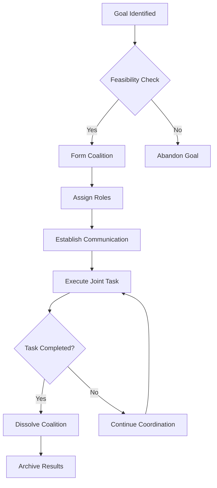

# Advanced Techniques

This section covers advanced patterns in agentic AI, including multi-agent coordination and complex tool usage.

## Multi-Agent Coordination Patterns

### 1. Coalition Formation
Agents form temporary alliances to achieve complex goals:

```typescript
interface Coalition {
  id: string;
  members: Agent[];
  goal: Goal;
  formationTime: Date;
  dissolutionCondition: () => boolean;
}

class CoalitionManager {
  formCoalition(agents: Agent[], goal: Goal): Coalition | null {
    // Evaluate if agents can form an effective coalition
    if (this.evaluateCoalitionPotential(agents, goal)) {
      const coalition: Coalition = {
        id: this.generateId(),
        members: agents,
        goal: goal,
        formationTime: new Date(),
        dissolutionCondition: () => this.shouldDissolve(agents, goal)
      };

      // Initialize coordination mechanisms
      this.setupCommunication(coalition);
      this.assignRoles(coalition);

      return coalition;
    }

    return null;
  }

  private evaluateCoalitionPotential(agents: Agent[], goal: Goal): boolean {
    // Check if agents have complementary capabilities
    const combinedCapabilities = this.aggregateCapabilities(agents);
    return this.goalAchievable(combinedCapabilities, goal);
  }

  private aggregateCapabilities(agents: Agent[]): Capability[] {
    // Combine capabilities of all agents
    return agents.flatMap(agent => agent.capabilities);
  }

  private goalAchievable(capabilities: Capability[], goal: Goal): boolean {
    // Determine if goal is achievable with given capabilities
    return goal.requiredCapabilities.every(req =>
      capabilities.some(cap => cap.matches(req))
    );
  }
}
```

Here's a Mermaid diagram illustrating the coalition formation process:



### 2. Role Assignment and Specialization
Assign specialized roles to agents in a multi-agent system:

```typescript
interface Role {
  name: string;
  responsibilities: Responsibility[];
  requiredCapabilities: Capability[];
  authorityLevel: number;
}

class RoleAssignmentSystem {
  assignRoles(agents: Agent[], task: ComplexTask): Map<Agent, Role> {
    const roleAssignments = new Map<Agent, Role>();
    const availableRoles = this.getAvailableRoles(task);
    
    // Match agents to roles based on capabilities
    for (const role of availableRoles) {
      const suitableAgents = agents.filter(agent => 
        this.agentMatchesRole(agent, role) && 
        !roleAssignments.has(agent)
      );
      
      if (suitableAgents.length > 0) {
        // Select best agent for role
        const bestAgent = this.selectBestAgent(suitableAgents, role);
        roleAssignments.set(bestAgent, role);
      }
    }
    
    return roleAssignments;
  }
  
  private selectBestAgent(candidates: Agent[], role: Role): Agent {
    // Use weighted scoring based on role requirements
    return candidates.reduce((best, current) => {
      const bestScore = this.calculateFitScore(best, role);
      const currentScore = this.calculateFitScore(current, role);
      return currentScore > bestScore ? current : best;
    });
  }
  
  private calculateFitScore(agent: Agent, role: Role): number {
    let score = 0;
    
    // Score based on capability match
    for (const req of role.requiredCapabilities) {
      if (agent.capabilities.some(cap => cap.matches(req))) {
        score += 1;
      }
    }
    
    // Score based on experience
    score += agent.experienceWeight(role.name) * 0.5;
    
    return score;
  }
}
```

### 3. Distributed Consensus Mechanisms
Achieve agreement among agents in a distributed system:

```typescript
interface ConsensusAlgorithm {
  reachConsensus(proposals: Proposal[], agents: Agent[]): ConsensusResult;
}

class MultiAgentConsensus implements ConsensusAlgorithm {
  reachConsensus(proposals: Proposal[], agents: Agent[]): ConsensusResult {
    // Use a variant of Raft or PBFT adapted for agents
    const votes = new Map<Proposal, number>();
    
    // Each agent votes on proposals
    for (const agent of agents) {
      const vote = this.getAgentVote(agent, proposals);
      if (votes.has(vote.proposal)) {
        votes.set(vote.proposal, votes.get(vote.proposal)! + vote.weight);
      } else {
        votes.set(vote.proposal, vote.weight);
      }
    }
    
    // Find proposal with majority
    const totalWeight = agents.reduce((sum, agent) => sum + agent.weight, 0);
    const threshold = Math.ceil(totalWeight / 2);
    
    for (const [proposal, weight] of votes.entries()) {
      if (weight >= threshold) {
        return {
          accepted: true,
          proposal: proposal,
          supportPercentage: weight / totalWeight
        };
      }
    }
    
    return {
      accepted: false,
      proposal: null,
      supportPercentage: 0
    };
  }
  
  private getAgentVote(agent: Agent, proposals: Proposal[]): { proposal: Proposal, weight: number } {
    // Agent evaluates proposals based on its preferences and capabilities
    const rankedProposals = this.rankProposals(agent, proposals);
    return {
      proposal: rankedProposals[0],
      weight: agent.weight
    };
  }
  
  private rankProposals(agent: Agent, proposals: Proposal[]): Proposal[] {
    // Rank proposals based on agent's utility function
    return proposals.sort((a, b) => agent.utility(b) - agent.utility(a));
  }
}
```

## Complex Tool Usage Patterns

### 1. Tool Composition and Chaining
Combine multiple tools to achieve complex tasks:

```typescript
interface ToolChain {
  tools: Tool[];
  inputMapping: Map<string, string>;
  outputMapping: Map<string, string>;
  executionOrder: number[];
}

class ToolComposer {
  composeTools(requiredFunctionality: Functionality[]): ToolChain | null {
    // Find tools that collectively provide required functionality
    const availableTools = this.getAvailableTools();
    const selectedTools = this.selectTools(availableTools, requiredFunctionality);
    
    if (!selectedTools || !this.canCompose(selectedTools, requiredFunctionality)) {
      return null;
    }
    
    // Determine execution order and data flow
    const executionOrder = this.calculateExecutionOrder(selectedTools);
    const dataFlow = this.analyzeDataDependencies(selectedTools);
    
    return {
      tools: selectedTools,
      inputMapping: dataFlow.inputMapping,
      outputMapping: dataFlow.outputMapping,
      executionOrder: executionOrder
    };
  }
  
  executeChain(chain: ToolChain, input: any): any {
    let currentData = input;
    
    for (const toolIndex of chain.executionOrder) {
      const tool = chain.tools[toolIndex];
      
      // Apply input mapping
      const mappedInput = this.applyInputMapping(
        currentData, 
        chain.inputMapping, 
        tool
      );
      
      // Execute tool
      const result = tool.execute(mappedInput);
      
      // Apply output mapping
      currentData = this.applyOutputMapping(
        result, 
        chain.outputMapping
      );
    }
    
    return currentData;
  }
  
  private calculateExecutionOrder(tools: Tool[]): number[] {
    // Topological sort based on dependencies
    const graph = this.buildDependencyGraph(tools);
    return this.topologicalSort(graph);
  }
}
```

### 2. Tool Learning and Adaptation
Enable agents to learn to use tools more effectively:

```typescript
interface ToolUsageModel {
  tool: Tool;
  usagePatterns: UsagePattern[];
  effectivenessScore: number;
  adaptationStrategy: AdaptationStrategy;
}

class ToolLearningSystem {
  learnToolUsage(agent: Agent, tool: Tool, environment: Environment): ToolUsageModel {
    // Observe tool usage patterns
    const usageLogs = this.collectUsageData(agent, tool, environment);
    
    // Analyze effectiveness
    const effectiveness = this.calculateEffectiveness(usageLogs);
    
    // Identify patterns
    const patterns = this.extractUsagePatterns(usageLogs);
    
    // Determine adaptation strategy
    const strategy = this.selectAdaptationStrategy(patterns, effectiveness);
    
    return {
      tool: tool,
      usagePatterns: patterns,
      effectivenessScore: effectiveness,
      adaptationStrategy: strategy
    };
  }
  
  adaptUsage(model: ToolUsageModel, newSituation: Situation): ToolUsageModification {
    // Apply adaptation strategy based on situation
    switch (model.adaptationStrategy.type) {
      case 'parameterAdjustment':
        return this.adjustParameters(model, newSituation);
      case 'patternSwitching':
        return this.switchPatterns(model, newSituation);
      case 'compositionChange':
        return this.modifyComposition(model, newSituation);
      default:
        return { unchanged: true };
    }
  }
  
  private calculateEffectiveness(logs: UsageLog[]): number {
    // Calculate effectiveness based on success rate, efficiency, etc.
    const successes = logs.filter(log => log.success).length;
    return successes / logs.length;
  }
  
  private extractUsagePatterns(logs: UsageLog[]): UsagePattern[] {
    // Use clustering or pattern recognition to identify common usage patterns
    return this.clusterLogs(logs).map(cluster => ({
      conditions: cluster.conditions,
      actions: cluster.actions,
      outcomes: cluster.outcomes
    }));
  }
}
```

### 3. Tool Discovery and Integration
Discover and integrate new tools into the agent's repertoire:

```typescript
interface ToolDiscoveryService {
  discoverTools(context: Context): DiscoveredTool[];
  evaluateTool(tool: DiscoveredTool, agent: Agent): ToolEvaluation;
  integrateTool(tool: DiscoveredTool, evaluation: ToolEvaluation): IntegrationResult;
}

class DynamicToolDiscovery implements ToolDiscoveryService {
  discoverTools(context: Context): DiscoveredTool[] {
    // Discover tools from various sources
    const apiTools = this.discoverFromAPIs(context);
    const serviceTools = this.discoverFromServices(context);
    const libraryTools = this.discoverFromLibraries(context);
    
    return [...apiTools, ...serviceTools, ...libraryTools];
  }
  
  evaluateTool(tool: DiscoveredTool, agent: Agent): ToolEvaluation {
    // Evaluate tool fitness for agent
    const capabilityMatch = this.matchCapabilities(tool, agent.capabilities);
    const safetyAssessment = this.assessSafety(tool);
    const performanceEstimate = this.estimatePerformance(tool);
    
    return {
      tool: tool,
      capabilityMatch: capabilityMatch,
      safetyRating: safetyAssessment.rating,
      performanceEstimate: performanceEstimate,
      integrationComplexity: this.estimateIntegrationComplexity(tool),
      recommendation: this.makeRecommendation(
        capabilityMatch, 
        safetyAssessment, 
        performanceEstimate
      )
    };
  }
  
  integrateTool(tool: DiscoveredTool, evaluation: ToolEvaluation): IntegrationResult {
    if (evaluation.recommendation !== 'integrate') {
      return { success: false, reason: 'Not recommended for integration' };
    }
    
    try {
      // Perform integration steps
      this.configureAuthentication(tool);
      this.setupErrorHandling(tool);
      this.registerCallbacks(tool);
      this.updateAgentCapabilities(tool);
      
      return { success: true, toolInterface: this.createInterface(tool) };
    } catch (error) {
      return { success: false, reason: error.message };
    }
  }
  
  private matchCapabilities(tool: DiscoveredTool, agentCaps: Capability[]): number {
    // Calculate how well tool capabilities match agent needs
    const neededCaps = this.identifyNeededCapabilities(agentCaps);
    const matchedCaps = neededCaps.filter(needed => 
      tool.capabilities.some(toolCap => toolCap.compatibleWith(needed))
    );
    
    return matchedCaps.length / neededCaps.length;
  }
}
```

## Self-Improvement and Reflection

### 1. Meta-Cognitive Patterns
Agents reflect on their own performance and improve:

```typescript
interface SelfReflectionSystem {
  analyzePerformance(history: ActionHistory): PerformanceAnalysis;
  identifyImprovementOpportunities(analysis: PerformanceAnalysis): ImprovementPlan[];
  executeImprovementPlan(plan: ImprovementPlan): ImprovementResult;
}

class MetaCognitiveSystem implements SelfReflectionSystem {
  analyzePerformance(history: ActionHistory): PerformanceAnalysis {
    // Analyze patterns in agent's behavior
    const goalAchievementRate = this.calculateGoalAchievementRate(history);
    const efficiencyMetrics = this.calculateEfficiencyMetrics(history);
    const learningIndicators = this.identifyLearningPatterns(history);
    const adaptationNeeds = this.identifyAdaptationNeeds(history);
    
    return {
      goalAchievementRate,
      efficiencyMetrics,
      learningIndicators,
      adaptationNeeds,
      strengths: this.identifyStrengths(history),
      weaknesses: this.identifyWeaknesses(history)
    };
  }
  
  identifyImprovementOpportunities(analysis: PerformanceAnalysis): ImprovementPlan[] {
    const plans: ImprovementPlan[] = [];
    
    // Plan for improving weak areas
    for (const weakness of analysis.weaknesses) {
      const plan = this.createImprovementPlan(weakness, analysis);
      if (plan) {
        plans.push(plan);
      }
    }
    
    // Plan for enhancing strengths
    for (const strength of analysis.strengths) {
      const enhancementPlan = this.createEnhancementPlan(strength, analysis);
      if (enhancementPlan) {
        plans.push(enhancementPlan);
      }
    }
    
    return plans;
  }
  
  executeImprovementPlan(plan: ImprovementPlan): ImprovementResult {
    // Execute the improvement plan
    switch (plan.type) {
      case 'skillDevelopment':
        return this.developSkill(plan.targetSkill);
      case 'strategyOptimization':
        return this.optimizeStrategy(plan.strategy);
      case 'toolAcquisition':
        return this.acquireTool(plan.toolRequirement);
      case 'knowledgeEnhancement':
        return this.enhanceKnowledge(plan.knowledgeArea);
      default:
        return { success: false, reason: 'Unknown plan type' };
    }
  }
  
  private calculateGoalAchievementRate(history: ActionHistory): number {
    const totalGoals = history.goalsAttempted;
    const achievedGoals = history.goalsAchieved;
    return achievedGoals / totalGoals;
  }
  
  private identifyWeaknesses(history: ActionHistory): Weakness[] {
    // Identify areas where agent performs poorly
    return history.failurePatterns.map(pattern => ({
      area: pattern.area,
      frequency: pattern.frequency,
      impact: pattern.impact
    }));
  }
}
```

### 2. Experience Replay and Learning
Learn from past experiences:

```typescript
interface ExperienceReplaySystem {
  storeExperience(experience: Experience): void;
  retrieveRelevantExperiences(query: ExperienceQuery): Experience[];
  extractKnowledge(experiences: Experience[]): KnowledgeFragment[];
  applyLearnings(context: Context, learnings: KnowledgeFragment[]): AppliedLearning;
}

class ExperienceReplaySystemImpl implements ExperienceReplaySystem {
  private experienceBuffer: Experience[] = [];
  private maxBufferSize: number;
  
  constructor(maxBufferSize: number = 10000) {
    this.maxBufferSize = maxBufferSize;
  }
  
  storeExperience(experience: Experience): void {
    this.experienceBuffer.push(experience);
    
    // Maintain buffer size
    if (this.experienceBuffer.length > this.maxBufferSize) {
      this.experienceBuffer.shift(); // Remove oldest experience
    }
  }
  
  retrieveRelevantExperiences(query: ExperienceQuery): Experience[] {
    // Use similarity matching to find relevant experiences
    return this.experienceBuffer.filter(exp => 
      this.isSimilar(exp.context, query.context, query.threshold)
    ).sort((a, b) => this.compareRelevance(a, b, query));
  }
  
  extractKnowledge(experiences: Experience[]): KnowledgeFragment[] {
    // Extract patterns and lessons from experiences
    const patterns = this.findCommonPatterns(experiences);
    const lessons = this.extractLessons(experiences);
    const strategies = this.identifySuccessfulStrategies(experiences);
    
    return [...patterns, ...lessons, ...strategies];
  }
  
  applyLearnings(context: Context, learnings: KnowledgeFragment[]): AppliedLearning {
    // Apply extracted knowledge to current context
    const applicableLearnings = learnings.filter(learning => 
      learning.applicableTo(context)
    );
    
    const adaptations = applicableLearnings.map(learning => 
      learning.generateAdaptation(context)
    );
    
    return {
      adaptations: adaptations,
      confidence: this.calculateConfidence(adaptations),
      expectedImprovement: this.estimateImprovement(adaptations)
    };
  }
  
  private findCommonPatterns(experiences: Experience[]): KnowledgeFragment[] {
    // Use pattern recognition to find common success/failure patterns
    return []; // Simplified implementation
  }
  
  private isSimilar(context1: Context, context2: Context, threshold: number): boolean {
    // Calculate similarity between contexts
    return this.calculateContextSimilarity(context1, context2) >= threshold;
  }
}
```

## Next Steps

After understanding advanced techniques, proceed to Chapter 7: Evaluation to learn about methodologies and metrics for assessing agentic AI systems.

## Related Sections

- [Chapter 5: Implementation Patterns](../chapter-5/implementation) - Implementation best practices
- [Chapter 7: Evaluation Methods](../chapter-7/evaluation) - Assessment methodologies
- [Chapter 8: Future Directions](../chapter-8/future-work) - Emerging trends