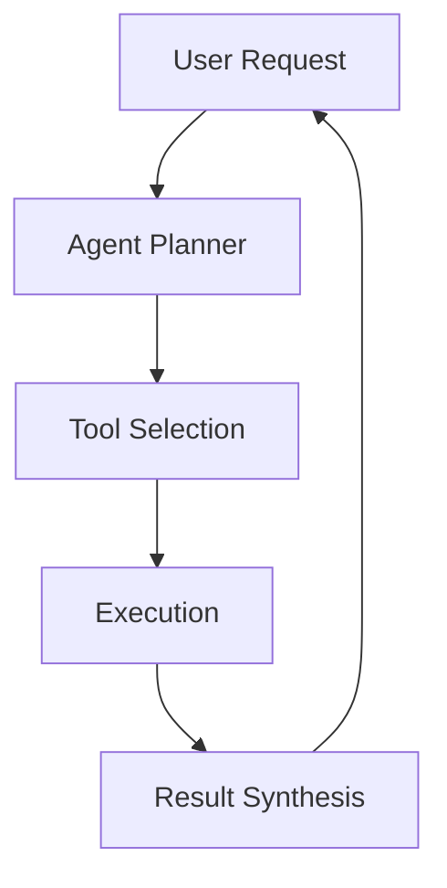

# Quickstart Guide: Contributing to Agentic AI Systems Research Documentation

## Overview
This guide provides a quick path to start contributing to the Agentic AI Systems Research Project documentation. It covers the essential steps to set up your development environment and begin creating content that aligns with our constitutional principles.

## Prerequisites
- Node.js (v18 or higher)
- npm or yarn package manager
- Git version control system
- Basic knowledge of Markdown syntax
- Understanding of agentic AI concepts (helpful but not required)

## Environment Setup

### 1. Clone the Repository
```bash
git clone <repository-url>
cd <repository-directory>
```

### 2. Install Dependencies
```bash
npm install
# or
yarn install
```

### 3. Start the Development Server
```bash
npm run start
# or
yarn start
```

This will launch the Docusaurus development server at `http://localhost:3000` with live reloading.

## Creating Documentation Content

### 1. Understanding the Structure
The documentation follows an 8-chapter book-style structure:
- `docs/intro.md` - Introduction to agentic AI systems
- `docs/chapter-1/` - Setup and environment
- `docs/chapter-2/` - Constitutional principles
- `docs/chapter-3/` - Specification approaches
- `docs/chapter-4/` - Planning methodologies
- `docs/chapter-5/` - Implementation patterns
- `docs/chapter-6/` - Advanced agentic patterns
- `docs/chapter-7/` - Evaluation techniques
- `docs/chapter-8/` - Future work and research directions

### 2. Creating a New Chapter Section
To create a new section within a chapter:

1. Navigate to the appropriate chapter directory (e.g., `docs/chapter-5/`)
2. Create a new Markdown file with a descriptive name
3. Add frontmatter with metadata:

```markdown
---
title: My New Section
sidebar_position: 3
description: Brief description of this section
---

# My New Section Title

Your content here...
```

### 3. Adding Code Examples
For code snippets that demonstrate agentic AI concepts:

```markdown
import CodeBlock from '@site/src/components/CodeBlock';

<CodeBlock language="typescript">
// Your code here
const agent = new AgenticAI({
  planning: true,
  tools: ['search', 'calculator'],
  memory: true
});
</CodeBlock>
```

### 4. Including Mermaid Diagrams
To add architecture or flow diagrams:



## Following Constitutional Principles

### Content Accuracy & Research-Based Approach
- Always cite sources when making factual claims
- Reference recent research (2025-2026 trends) where possible
- Use the `:::info` admonition to highlight important citations:

```markdown
:::info
Recent research by Smith et al. (2026) demonstrates that multi-agent systems show 40% better performance in complex planning tasks compared to single-agent approaches.
:::
```

### Academic Language & Professional Communication
- Use precise, technical terminology
- Define terms when first introduced
- Maintain a scholarly tone throughout

### Structured Documentation Format
- Organize content logically with proper heading hierarchy
- Use H1 for page titles (automatically handled by Docusaurus)
- Use H2 for major sections and H3 for subsections

### Visual Aids & Practical Examples
- Include diagrams to illustrate complex concepts
- Provide executable code examples when possible
- Use tables for comparing different approaches

## Adding Blog Posts

To create a new blog post:

1. Create a new file in the `blog/` directory with the format `YYYY-MM-DD-title.md`
2. Include frontmatter:

```markdown
---
title: Latest Advances in Agentic AI
authors: [your-name]
tags: [research, advances, multi-agent]
---

Your blog post content here...
```

## Quality Assurance Checklist

Before submitting content, ensure:

- [ ] Content follows academic language standards
- [ ] All claims are properly cited or marked as opinion
- [ ] Code examples are tested and functional
- [ ] Diagrams accurately represent the described concepts
- [ ] Cross-references to other sections are valid
- [ ] Content is modular and can be understood independently
- [ ] The constitutional principles are reflected in the content

## Building and Previewing

To build the static site locally:

```bash
npm run build
# or
yarn build
```

To serve the built site locally:

```bash
npm run serve
# or
yarn serve
```

## Deployment

The site is automatically deployed when changes are merged to the main branch. For preview deployments, create a pull request and the CI system will generate a preview URL.

## Need Help?

- Check the full contributor documentation in the `docs/contributing/` section
- Join our community Discord for real-time help
- File an issue for bugs or enhancement suggestions